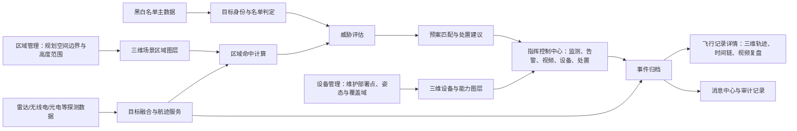
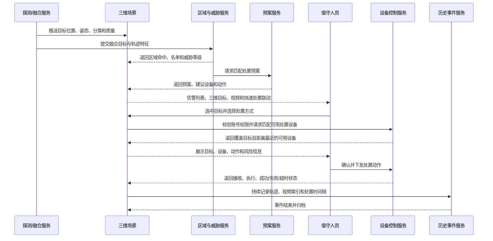

# 低空防御指挥控制平台——系统三维地图功能设计与实现说明

> 文档版本：V1.0  
> 文档状态：产品工作交接版  
> 编制日期：2026-07-02  
> 适用范围：指挥控制中心（数据大屏）、飞行记录详情、区域管理及相关联的设备、黑白名单、威胁评估、预案策略和消息模块

## 1. 文档目的

本文档作为产品工作交接基线，面向系统三维地图研发、三维模型制作、前后端业务开发、设备接入及现场实施人员，统一描述低空防御指挥控制平台的三维空间表达、业务联动、输入输出和实现要求。文档覆盖指挥控制中心、飞行记录详情、区域管理，以及与地图直接联动的设备、黑白名单、威胁评估、预案策略和消息模块。

系统以三维地图作为统一空间底座。无人机以对应类型和型号的无人机三维模型呈现；飞鸟、气球、风筝及其他空飘物采用独立模型或模型族呈现；区域以具有高度范围的三维区域体和发光围栏呈现；设备以三维模型、探测域和作用域呈现；实时航迹与历史航迹均在真实三维空间中表达。

名单属性、威胁等级、告警状态和处置状态通过模型外形、颜色、光圈、标签、光柱、作用线及动态图效组合展示。区域管理负责规划空间范围和区域规则；指挥控制中心承接实时监测、识别、评估、告警与反制业务；飞行记录详情负责回放目标飞行形成的历史空间信息。各模块共享同一套区域、目标、设备、模型和坐标语义。

## 2. 总体结论

系统三维地图不是单一页面组件，而是贯穿平台业务的“空间业务底座”。区域管理定义在哪里监测、告警和处置；设备管理定义由什么设备覆盖和执行；目标融合服务持续产生目标位置；黑白名单和威胁评估确定目标属性与风险；预案策略确定可执行动作；指挥控制中心完成实时态势展示和人工指挥；事件结束后，轨迹、视频、处置节点和消息被固化到历史记录中，用于复盘与取证。

三类核心地图页面使用同一份空间数据，但工作模式不同：

| 模块 | 时间语义 | 主要目的 | 地图操作侧重 |
| --- | --- | --- | --- |
| 区域管理 | 规划态 | 定义区域边界、高度、层级和业务属性 | 绘制、编辑、校验、发布 |
| 指挥控制中心/数据大屏 | 实时态 | 监测目标、接收告警、联动光电和设备、执行处置 | 观察、筛选、锁定、跟踪、处置 |
| 飞行记录详情-地图轨迹 | 历史态 | 回放目标飞行、设备发现、评估和处置过程 | 播放、暂停、倍速、时间定位、复盘 |

## 3. 三维业务对象与设计基础

### 3.1 区域对象

区域对象包含区域编号、名称、上级区域、区域类型、自定义空间边界、相对地面高度上限、裁剪优先级、业务优先级、告警开关、颜色、发光样式、生效时间和版本状态。区域类型覆盖预警区、警戒区、识别处置区、禁飞区、报警屏蔽区、核岛、乏燃料水池、试飞区和其他区域。

区域范围由用户自由绘制，支持矩形、圆形、多边形、多图形及带孔洞区域。区域高度统一采用相对地面高度（AGL），同一区域对应一个连续高度范围，不再拆分垂直子层。空间边界与高度范围共同构成三维区域体。多区域重叠时，高优先级区域默认覆盖低优先级区域，并分别处理渲染优先级、业务优先级和父子层级。

### 3.2 目标与飞行记录对象

目标对象包含融合目标 ID、飞行编号、飞行物分类、具体型号、识别码、名单类型、威胁等级、三维位置、姿态、速度、轨迹质量、数据来源、所在区域、探测设备、关联飞手、命中预案和当前处置状态。

飞行记录保存发现、跟踪、评估、处置、解除和归档全过程，包含三维轨迹点、关键时间标记、设备处置时间链、光电视频索引、名单状态快照、威胁变化和区域命中记录。该对象同时支撑历史查询、三维回放、轨迹明细和取证导出。

### 3.3 身份、分类与名单对象

系统将飞行物分类、身份识别状态、名单属性和威胁等级作为相互独立的业务维度：

- 飞行物分类描述目标是什么，包括多旋翼无人机、固定翼无人机、飞鸟、气球、风筝及其他空飘物；
- 身份识别状态描述系统是否获得稳定识别码或可信身份；
- 名单属性描述已确认身份属于黑名单、白名单或未知；
- 威胁等级结合区域、轨迹、名单、行为和环境因素动态计算。

“黑飞无人机”表示未经授权、身份未解析或无法稳定关联身份的无人机目标，不直接等同于“黑名单”。系统力求通过 Remote ID、SN、无线电特征、多源航迹关联等信息识别目标唯一性。身份尚不能稳定确认的黑飞目标不直接写入永久黑名单，而是保留临时目标、特征摘要和历史关联；后续达到可靠匹配条件后，再关联为同一身份对象。飞鸟、气球、风筝等非无人机目标统一进入“躁扰目标”大类，并保留具体子类型信息。

## 4. 模块关系与业务闭环

### 4.1 区域管理是空间规则来源

区域管理发布的区域应被指挥控制中心、威胁评估和预案策略共同引用。目标进入或离开区域时，系统不只改变地图显示，还应形成区域进入、区域停留、区域越界和区域离开等业务事件。区域 ID 是模块间关联的稳定标识，区域名称仅用于展示。

### 4.2 指挥控制中心是实时业务承接端

指挥控制中心接收目标、告警、设备、区域、视频、名单、威胁和预案结果，并通过三维地图将这些数据组织到同一空间上下文中。地图上的目标选中状态应同步到告警列表、光电视频和设备列表；列表选中也应反向定位三维目标。

### 4.3 地图轨迹是事件历史空间信息

历史轨迹不是独立绘制的数据，而是实时目标航迹在事件结束后的持久化结果。系统保存原始轨迹、融合轨迹、关键时间点和轨迹质量信息。回放使用事件发生时的模型、区域版本和设备位置快照，完整还原历史三维态势。

## 5. 三维地图总体实现架构

### 5.1 分层结构

三维地图按以下逻辑层实现：

1. 三维引擎适配层：封装场景初始化、相机、拾取、图层、模型、轨迹、区域体、测量和截图等基础能力，避免业务页面直接依赖某一引擎 API。
2. 场景数据层：统一管理区域、设备、目标、轨迹、告警、飞手、图例和可见性状态。
3. 业务联动层：处理目标选中、区域命中、名单变化、威胁变化、视频联动和处置状态变化。
4. 页面编排层：数据大屏、区域管理、飞行记录详情根据工作模式组合相同的场景能力。
5. 数据接入层：通过 HTTP 获取基础数据和历史数据，通过实时消息通道接收目标、告警、设备状态和处置回执。

三维地图、模型资源、底图、地形、建筑数据和业务服务离线部署于项目本地服务器，不依赖互联网公共服务。三维引擎及运行环境满足国产化部署要求，支持离线授权、离线资源加载和本地升级维护；技术实现采用能够承载地形、三维模型、三维瓦片、空间量测和大规模实体渲染的 WebGL GIS 能力底座。

### 5.2 统一场景图层

| 图层 | 主要对象 | 默认层级 | 说明 |
| --- | --- | --- | --- |
| 基础环境层 | 影像、地形、建筑、道路、关键设施 | 最底层 | 支撑空间定位和现场语义 |
| 区域层 | 预警区、警戒区、处置区、禁飞区、屏蔽区、试飞区等 | 基础环境之上 | 以地面填充、立体围栏和顶部轮廓构成立体区域 |
| 设备层 | 雷达、无线电、光电、干扰、激光、微波、声光设备 | 区域之上 | 展示设备模型、状态、朝向、覆盖域和锁定关系 |
| 目标层 | 无人机、飞鸟、气球、风筝、其他空飘物、飞手 | 主业务层 | 使用三维模型、标签、名单和威胁特效展示 |
| 航迹层 | 实时尾迹、预测线、历史轨迹、来源轨迹 | 目标关联层 | 支持方向、时间、速度、高度和质量表达 |
| 告警处置层 | 告警波纹、锁定线、设备作用链、处置结果 | 最上层 | 突出当前需要操作员关注的对象 |
| UI 辅助层 | 图例、测量结果、区域开关、气泡详情 | 屏幕空间层 | 不随三维遮挡丢失关键提示 |

### 5.3 统一对象标识

同一目标在多个探测源中可能具有不同源目标编号。系统至少区分：

- `sourceTargetId`：雷达、无线电、光电等单一数据源中的目标编号；
- `fusedTargetId`：目标融合服务生成的统一目标编号；
- `flightId`：目标融合后形成的一次连续飞行及告警架次编号；
- `eventId`：一次需要处置和归档的业务事件编号；
- `identityId`：可被黑白名单长期管理的身份编号，如 Remote ID、SN 或经确认的其他标识。

三维场景使用 `fusedTargetId` 更新实时实体，告警架次按融合结果对应的 `flightId` 统计，历史详情按 `eventId` 查询，名单管理按 `identityId` 维护长期属性。雷达、无线电、光电等多个设备同时发现同一目标时，各自保留来源记录，但经融合后只形成一个实时目标和一个告警架次。

## 6. 三维目标模型与可视语义

### 6.1 飞行物模型分类

系统建立可配置的三维模型资源表，使不同飞行物分类和无人机型号具有可辨识的三维外形。

| 目标分类 | 三维表现 | 关键属性 |
| --- | --- | --- |
| 多旋翼无人机 | 多旋翼无人机三维模型，旋翼动画 | 型号、识别码、名单、威胁、航向、速度、高度 |
| 固定翼无人机 | 固定翼无人机三维模型 | 型号、航向、速度、高度、爬升率 |
| 行业级/大型无人机 | 对应尺寸级别的无人机三维模型 | 任务属性、载荷、所属单位、任务用途 |
| 飞鸟 | 飞鸟三维模型或低成本群体模型，扑翼动画可按距离启停 | 单体/鸟群、躁扰概率、轨迹特征 |
| 气球 | 气球或系留气球三维模型，缓慢漂移动画 | 风向关联、上升率、尺寸、是否系留 |
| 风筝及其他空飘物 | 风筝、塑料漂浮物等模型或分类占位模型 | 分类置信度、轨迹不规则性 |
| 未识别目标 | 通用低空目标模型或半透明占位体 | 识别置信度、来源数量、待核查状态 |

模型选择优先使用“识别类型 + 型号映射”，无法识别具体型号时回退到分类通用模型，再无法识别时使用未知目标模型。模型朝向应由航向、俯仰和横滚数据驱动；数据源缺失时应使用平滑后的运动方向估算航向，并明确显示为估算值。

### 6.2 名单、威胁与处置状态表达

三维模型本体表达“它是什么”，外部视觉效果表达“系统如何判断它”，并采用以下组合表达：

- 黑名单：红色外轮廓或红色底部光圈、黑名单标签、较高闪烁频率；
- 白名单：青绿色外轮廓或光圈、白名单标签；名单仅作为目标属性，不直接免除威胁评估；
- 未知：黄色外轮廓或光圈、待识别标签；
- 高危/中危/低危/无危：通过告警光柱、标签边框和波纹强度表达，避免与名单颜色完全重叠；
- 处置中：增加锁定线、设备作用线、脉冲或扫描效果；
- 已解除：停止动态图效，保留短时淡出尾迹；
- 数据中断：模型半透明并显示“航迹外推”或“数据中断”，不得伪装成实时真值。

颜色不是唯一编码。三维模型外形、图标、文字标签和动画节奏应共同表达状态，以适应远距离观察和色觉差异。

### 6.3 目标详情气泡

点击目标后展示目标 ID、飞行编号、目标分类、识别码、型号、名单状态、威胁等级、识别置信度、数据来源、所在区域、高度、经纬度、距离、速度、航向/方位角、俯仰角、首次发现时间、持续时间、命中威胁规则、命中预案和当前处置状态。

详情气泡中的字段与大屏告警列表、历史事件和黑白名单详情应使用统一字典和格式化规则。

### 6.4 躁扰目标

躁扰目标是系统中的独立飞行物大类，覆盖飞鸟、鸟群、气球、系留气球、风筝及其他空飘物。系统保留躁扰目标的融合目标 ID、具体子类型、识别置信度、三维位置、速度、高度、轨迹特征、发现设备、出现区域、持续时间和处置记录。

三维场景根据具体子类型切换模型，并在类型暂未确定时使用通用躁扰目标模型。躁扰目标可形成告警、消息、历史事件和轨迹记录，也可参与威胁评估；其处置动作依据目标类别过滤，不进入无人机身份黑白名单。

## 7. 三维区域与发光围栏

### 7.1 三维区域数据扩展

三维区域对象包含以下核心字段：

| 字段 | 说明 |
| --- | --- |
| `geometry` | 真实经纬度坐标组成的 Polygon/MultiPolygon 或圆形参数 |
| `minHeightAgl` | 相对地面最低高度，默认从地面起算 |
| `maxHeightAgl` | 相对地面最高高度，对应区域准飞或管制高度上限 |
| `altitudeDatum` | 固定使用相对地面高度 AGL |
| `effectiveFrom/effectiveTo` | 区域生效时间，可支持临时管制区 |
| `version/status` | 草稿、已发布、已停用及版本号 |
| `styleConfig` | 颜色、透明度、边线、发光、动画和标签配置 |
| `ruleConfig` | 是否告警、是否屏蔽、允许的目标/名单、越界规则 |

每个区域使用一个连续的相对地面高度范围，不在同一区域内继续拆分高度层。三维场景按照地表起伏计算围栏底部，并依据 `maxHeightAgl` 拉伸区域墙体，使区域准飞高度、管制高度和目标飞行高度能够直接比较。

### 7.2 发光围栏构成

每个三维区域可由四部分构成：

1. 地面填充面：低透明度显示区域覆盖范围；
2. 垂直围栏墙：从地面 `0 AGL` 拉伸至 `maxHeightAgl`；
3. 顶部和底部轮廓线：强调区域高度边界；
4. 区域标签：显示区域名称、类型、高度范围和告警状态。

“发光围栏”使用边缘发光、向上流动纹理、扫描光带和呼吸透明度组合实现。动态效果由区域状态驱动：

- 常态区域：低频呼吸或静态微光；
- 目标进入：入侵点附近出现扩散波纹，围栏短时增强；
- 高危告警：围栏边线加亮并提高脉冲频率；
- 处置中：显示设备至目标的作用线和区域内扫描效果；
- 报警屏蔽区/试飞区：保持低亮度，避免与高危区域竞争视觉焦点；
- 区域关闭或未生效：灰化或隐藏，并在区域工具中保留状态提示。

### 7.3 多区域重叠规则

系统保留“裁剪优先级”概念，并将几何叠放与业务判定分开：

- 渲染优先级决定区域覆盖顺序；高优先级区域默认覆盖低优先级区域；
- 业务优先级决定多个区域同时命中时采用哪条告警和处置规则；
- 父子层级表达组织关系，不自动等同于几何包含；
- 完全包含、部分相交、多图形和孔洞区域均进行空间校验；
- 一个目标可同时命中多个区域，但业务输出应包含主命中区域和全部命中区域，便于审计。

### 7.4 区域可见性

指挥控制中心的“区域可见性”工具按区域类型和具体区域两级控制。关闭显示只影响场景渲染，不影响后台区域命中、告警和预案判断。工具面板中明确区分“隐藏图层”与“停用区域”，防止值守人员误解。

## 8. 数据大屏/指挥控制中心

### 8.1 页面定位

数据大屏是平台核心值守和处置入口。三维地图位于页面中心，告警、消息、光电视频、设备和处置按钮围绕地图组织。页面所有模块应围绕“当前选中目标”和“当前事件”联动，而不是各自独立展示。

### 8.2 基本内容

#### 8.2.1 告警架次

展示今日告警架次、本月告警架次、当前未结束告警架次等指标。告警架次以目标融合结果为统计口径：多个雷达、无线电或光电设备识别到同一目标时，先保留各设备来源数据，再聚合为一个 `fusedTargetId` 和一个连续飞行 `flightId`，大屏只统计一个告警架次。点击统计项可筛选告警列表和地图目标。

#### 8.2.2 告警列表

告警列表展示目标类型、目标 ID、发现时间、型号、识别码、名单类型、威胁等级、所在区域、命中预案、处置状态和持续时间。点击列表项时：

1. 三维相机定位并跟随对应目标；
2. 目标三维模型进入选中状态；
3. 打开目标详情气泡；
4. 光电视频切换到关联设备或目标通道；
5. 设备列表突出显示正在探测、跟踪或可执行处置的设备；
6. 底部快速处置按钮根据目标属性、设备能力和权限刷新可用状态。

地图点击目标时执行同样的反向联动，并滚动告警列表至对应记录。

#### 8.2.3 消息

消息区域展示威胁评估、预案命中、设备故障、人工处置、目标迫降等最新消息。消息中的目标、设备、区域均应可点击定位。点击“查看更多”进入消息中心；消息中心保留事件分类、推送时间和模板化描述。

#### 8.2.4 光电视频

展示可见光和红外通道，支持通道切换、播放状态、跟踪状态、截图/录像等能力。选中目标后优先显示已锁定该目标的光电设备；没有关联设备时提示“暂无关联光电”，不得自动展示无关画面。

系统根据设备协议提供变倍、调焦、测距、照明、曝光、云台方位/俯仰和目标跟踪能力。控制操作显示设备回执和超时状态，并记录操作人、目标、事件和参数。

用户启动“光电视角跟踪”后，系统联动可覆盖该目标的光电设备，将云台视角持续指向目标，并在三维地图中展示光电设备至目标的视线和视场范围。目标脱离视场、光电设备离线或跟踪丢失时，视频区和三维地图同步提示，允许用户切换其他可用光电设备。

#### 8.2.5 设备列表

展示雷达、光电、无线电侦测、无线电干扰、导航诱骗、激光、高功率微波和声光设备。设备在地图上使用对应三维模型并显示在线、离线、故障、运行、锁定、做功等状态。

点击设备后展示设备名称、类型、序列号、部署位置、经纬高、方位/俯仰、运行工况、覆盖范围、当前锁定目标和可用动作。探测设备可显示球形、圆锥或扇形探测域；定向反制设备可显示随方位和俯仰变化的作用扇区。

#### 8.2.6 三维地图可视化

三维地图应同时展示：

- 无人机、飞鸟、气球等低空目标的三维模型；
- 飞手位置及目标与飞手的关联线；
- 目标实时轨迹、历史尾迹和短时预测轨迹；
- 预警区、警戒区、识别处置区、禁飞区、屏蔽区、试飞区等三维发光围栏；
- 雷达、光电、无线电、干扰、激光、微波和声光设备及覆盖域；
- 告警波纹、区域越界点、设备锁定线和处置作用链；
- 当前事件详情和关键处置节点。

#### 8.2.7 底部快速打击处置按钮

底部提供无线电干扰、导航诱骗、声光驱离、激光打击、高功率微波打击、人工打击、持续打击和解除反制等快速处置入口。按钮操作通过以下完整流程转化为设备执行：

1. 校验当前登录账号是否拥有对应处置方式的操作权限；无权限时按钮不可执行并提示权限不足；
2. 用户先在三维地图或告警列表中选中待处置无人机目标，再点击处置方式，例如“激光打击”；
3. 系统校验目标仍处于有效跟踪状态，并读取其位置、区域、威胁等级、名单属性和命中预案；
4. 系统从全部处置设备中筛选支持该动作、在线、无故障、未被占用、通过安全互锁且作用范围覆盖目标的设备；
5. 对候选设备按目标距离排序，自动选择距离目标最近的可用处置设备；
6. 页面展示目标、自动选择的设备、动作、预计作用距离和风险信息，由用户确认后下发；
7. 指令进入“校验中—待确认—发送中—设备已接收—执行中—执行成功/失败/超时”状态；
8. 三维地图同步展示处置设备高亮、设备至目标的作用线、锁定状态和打击动态效果；
9. 解除反制时停止设备动作、关闭作用效果并记录完整回执。

白名单仅作为目标属性，不直接阻止威胁评估或处置。白名单目标通常因允许的飞行行为被评估为低危或无危；当其行为命中特定威胁规则并满足处置条件时，仍可由具备权限的账号执行处置。对飞鸟、气球等躁扰目标，系统按具体子类型过滤处置动作，例如优先提供持续观察或声光驱离，不展示不适用的无人机链路干扰动作。

#### 8.2.8 目标名单属性调整

用户选中具备稳定身份的无人机目标后，可在告警列表或目标详情中执行加入黑名单、加入白名单、移出黑名单、移出白名单等操作。操作成功后，三维模型光圈、标签、告警列表和详情立即刷新，并使用新的名单属性重新执行威胁评估。

身份尚不稳定的黑飞目标不显示永久名单写入操作，页面提示“目标身份尚未稳定识别，已保留临时关注记录”。飞鸟、气球、风筝等躁扰目标展示分类信息和历史记录，不进入无人机黑白名单。

### 8.3 地图工具

#### 8.3.1 区域可见性

按区域类型和具体区域切换显示。工具状态仅改变显示，不改变区域业务规则。

#### 8.3.2 重置视角

恢复项目预设的中心点、方位、俯仰和缩放级别；若当前处于目标跟随、设备跟随或第一视角，应先退出跟随模式。区域管理页的重置视角可优先适配当前编辑区域范围。

#### 8.3.3 测量工具

包含距离测量、角度测量、高度测量、水平距离、空间距离、地面距离、高差、面积和方位角，并在结果中标明单位和高度基准。测量结果属于操作员临时标绘，默认不写入业务数据。

#### 8.3.4 图例可见性

控制图例面板显隐，并可按图例分类控制目标、侦测设备、反制设备、飞鸟、飞手、轨迹和告警效果。图例过滤只改变场景显示；被隐藏的高危目标仍应在告警列表中保留明显提示。

### 8.4 相机与跟随模式

地图应支持全局态势、目标跟随、设备观察、区域聚焦和自由浏览。目标跟随时相机保持合适的后上方视角，并允许操作员临时旋转；目标消失、事件结束或用户点击重置时退出跟随。高频目标更新不应直接驱动相机抖动，应对位置和姿态进行插值平滑。

## 9. 区域管理

### 9.1 区域列表与层级

区域列表提供管理视图和架构视图，支持按区域编号、名称、类型、告警开关和上级区域查询。区域树表达站点或防区层级；树节点点击可筛选当前区域及其全部下级。

删除区域前校验是否存在下级区域、是否被威胁规则引用、是否被预案策略引用、是否存在进行中的事件。父区域删除时不自动提升子区域，由用户明确选择迁移上级或同步停用。

### 9.2 新增/编辑区域

区域空间绘制支持以下能力：

- 基于真实地图选点，支持经纬度精确输入和顶点列表编辑；
- 支持图形整体平移、控制点调整、撤销/重做和吸附；
- 区域范围完全自定义，支持矩形、圆形、任意多边形、多图形和带孔洞区域；
- 配置相对地面高度上限，高度基准固定为 AGL，同一区域不拆分高度层；
- 配置颜色、透明度、发光强度、围栏动画和标签样式；
- 配置告警开关、区域优先级、生效时间和适用目标；
- 保存草稿、预览三维效果、发布和停用；
- 校验自相交、非法经纬度、高度值无效、父子层级循环和不合理重叠。

区域绘制和编辑过程中实时计算重叠关系。高优先级区域默认覆盖低优先级区域，三维预览同步显示最终覆盖结果；低优先级区域数据仍然保留，便于后续调整优先级或关闭高优先级区域后恢复显示和业务判断。

### 9.3 区域发布与场景同步

区域编辑采用“草稿—校验—发布—生效”的版本流程，不因草稿保存改变正在值守的三维场景。发布后向场景服务、威胁评估和预案服务发送区域版本变更事件；指挥控制中心增量更新三维区域图层。历史事件保存当时使用的区域 ID、区域版本和名称快照。

## 10. 飞行记录详情——三维地图轨迹

### 10.1 页面内容

飞行记录详情包含基本信息、设备处置时间链、光电回放、三维地图轨迹和轨迹明细表。三维轨迹与光电录像通过同一事件 ID 和统一时间轴关联；三维轨迹场景复用指挥控制中心的模型、区域和设备样式，并按历史快照恢复事件现场。

### 10.2 轨迹数据

三维轨迹点至少包含：

- 时间戳、经度、纬度、相对地面高度 AGL；
- 水平速度、垂直速度、航向、俯仰和横滚；
- 数据源、源目标 ID、融合目标 ID；
- 位置精度、识别置信度、轨迹质量；
- 所在区域 ID 集合和主区域 ID；
- 名单、威胁和处置状态快照；
- 是否为真实上报点、融合点或丢失后的外推点。

原始源轨迹和融合轨迹可按权限切换。默认显示融合轨迹；多源合并时显示“已合并多条同架次记录”说明，并允许查看轨迹来源。

### 10.3 三维回放

回放支持播放、暂停、重新播放、进度拖动和 1/2/5/10/20 倍速。回放过程中同步更新：

- 无人机或其他飞行物三维模型位置和姿态；
- 已播放轨迹和未播放轨迹的颜色；
- 当前时间、高度、经纬度、距离、速度、方位角和俯仰角；
- 当前所在区域和区域围栏告警效果；
- 发现、人工核查、威胁评估、预案命中、设备锁定、处置、解除和归档节点；
- 光电视频播放进度和设备处置时间链；
- 对应时刻的名单和威胁状态。

操作员可在“全局观察”和“跟随目标”之间切换。时间轴跳转时，地图、视频、明细表和处置时间链应定位到同一时刻。

### 10.4 轨迹样式

- 航迹方向使用箭头、渐变或流动纹理表达；
- 高度可通过真实三维位置、垂线和高度标签表达；
- 真实点、融合点和外推点使用不同线型；
- 进入重点区域前后的轨迹可按事件阶段着色；
- 处置作用点、迫降点和最后发现点使用独立标记；
- 大量轨迹点按相机距离进行抽稀，但导出和查询仍保留原始精度。

### 10.5 轨迹导出与取证

系统支持轨迹明细、三维轨迹数据、场景截图、关键帧和回放摘要导出。导出内容包含坐标系、高度基准、数据来源、时间范围和数据完整性说明。

### 10.6 保存与回放期限

历史事件、融合轨迹、来源轨迹、光电录像、视频索引、设备处置时间链、名单与威胁状态快照的在线保存和可回放期限均不少于六个月。轨迹和光电录像使用统一时钟，回放时由同一时间轴驱动；任一数据片段缺失时在时间轴中明确标记，不使用其他时刻的数据补位。

## 11. 黑白名单与三维地图联动

### 11.1 业务概念

黑白名单用于管理可稳定识别的目标身份，不直接替代威胁评估：

- 白名单是目标身份属性，表示该目标通常属于已知或允许飞行对象，但仍需完整参与威胁评估；
- 黑名单表示需要重点监控或限制，不等于系统可以跳过安全校验自动打击；
- 未知表示尚未完成名单确认；
- 黑飞无人机表示未获授权、身份未解析或无法建立稳定身份关联的目标类别，与“黑名单”是不同维度；
- 飞鸟、气球等非无人机目标进入目标分类和躁扰事件管理，不应强行写入无人机身份名单。

### 11.2 名单操作入口

系统统一提供以下名单操作入口：

1. 指挥控制中心告警列表或目标详情：加入黑名单、加入白名单、移出名单；
2. 历史事件列表：对选中事件批量加入黑名单或白名单；
3. 飞行记录详情：在核查身份后调整名单；
4. 黑白名单管理：新增、编辑、删除、调整有效期和查看目标详情；
5. 外部名单系统：通过接口同步目标名单属性和有效状态。

所有入口最终调用同一名单服务，避免页面各自保存一份状态。

### 11.3 新增和编辑

新增名单维护名单类型、目标类别、目标 ID、识别码、机型、频段、有效期、录入方式、来源、备注和审批信息。有效期支持永久或指定起止时间。名单不承担区域准飞、航线许可或威胁结论职责，仅作为目标属性供威胁评估和展示使用。

合作式无人机应校验识别码。身份未解析的黑飞目标不能直接当作稳定主数据，可先形成“临时关注对象”，在后续解析出识别码、人工确认身份或形成可信设备指纹后再转为正式名单记录。

### 11.4 名单状态对实时业务的影响

| 状态 | 三维显示 | 告警策略 | 处置策略 |
| --- | --- | --- | --- |
| 黑名单 | 红色轮廓/光圈、黑名单标签、重点尾迹 | 提高关注优先级，可触发专用威胁规则 | 仍需区域、设备、安全和授权校验 |
| 白名单 | 青绿色轮廓/光圈、白名单标签 | 继续参与威胁评估；正常允许行为通常输出低危或无危，特定受限行为仍可告警 | 根据实时威胁、预案、账号权限和设备条件决定 |
| 未知 | 黄色轮廓/光圈、待核查标签 | 按区域和轨迹规则正常评估 | 根据威胁和预案决定是否允许处置 |
| 临时关注 | 橙色虚线光圈、临时标签 | 提高跟踪和人工核查优先级 | 不等同正式黑名单 |
| 名单过期 | 灰黄提示、过期标记 | 回退到未知或重新评估 | 禁止继续按过期授权放行 |

所有目标无论属于白名单、黑名单还是未知，均进入威胁评估。白名单目标绝大多数正常飞行行为由规则评估为低危或无危；当其速度、高度、区域、滞留、侵入次数、蜂群特征或其他行为命中特定限制规则时，可被评估为更高威胁等级并触发告警或处置预案。黑名单也不固定对应某一威胁等级，最终结论始终由实时规则计算。

### 11.5 移出、删除与历史保留

“移出黑名单/白名单”是调整名单属性；“删除目标主数据”是删除长期身份记录；“删除历史事件”是删除单次事件记录。三类操作语义必须分开。

名单变化不应改写历史事件发生时的名单快照。历史页面可以展示“事件发生时名单状态”和“当前名单状态”。删除名单主数据前应提示其关联历史事件数量；历史事件原则上继续保留，以满足复盘和审计要求。

### 11.6 一致性、有效期和审计

- 同一识别码只能存在一条当前有效的主名单记录；
- 同一目标 ID 与识别码冲突时进入人工核查，不自动覆盖；
- 名单到期后自动失效并产生消息；
- 所有新增、编辑、切换、移出、删除和批量操作记录操作人、时间、来源页面、原因和审批信息；
- 名单变更通过实时事件更新三维目标样式、告警列表、详情气泡和预案判断；
- 页面更新失败时回滚视觉状态，不出现地图显示白名单而后台仍为黑名单的情况。

## 12. 其他相关模块

### 12.1 设备管理

设备管理提供三维场景中的设备主数据和部署数据，包括经纬度、海拔/离地高度、安装方位、安装俯仰、设备模型、探测范围、最小/最大作用距离、水平/垂直角、盲区和所属设备组。

设备位置变更应经过发布流程，并同步到指挥控制中心和历史事件的新记录。历史回放使用事件发生时的设备位置快照。

### 12.2 威胁评估

威胁规则包含名单属性、目标类型、速度、停留时长、入侵次数、蜂群数量、相对地面高度、信号强度和所在区域等条件。三维地图为这些条件提供空间事实：目标进入哪个区域、是否超过区域高度要求、停留多长时间、是否形成蜂群。白名单、黑名单和未知目标统一参与评估，名单仅作为规则输入之一。

威胁等级变化时，三维目标、告警列表、声光提示和消息应同步更新。地图只展示评估结果，不在前端重复实现威胁规则计算。

### 12.3 预案策略

预案策略直接引用区域管理数据，并按具体区域配置触发策略、设备组和设备动作。区域命中、威胁等级、名单、天气和设备状态共同决定预案匹配结果。

指挥控制中心的快速处置按钮优先展示命中预案建议，并说明预案名称、触发规则、处置方式和自动/人工模式。用户选择处置方式后，系统再依据设备能力、在线状态、作用范围、占用状态和目标距离自动选择最近可用处置设备。操作员临时改用其他动作时填写原因。

### 12.4 消息中心

消息中心承接目标发现、威胁评估、预案命中、处置执行、目标迫降、名单到期、区域变更和设备故障等消息。消息中的目标 ID、区域 ID、设备 ID 和事件 ID 应作为可跳转关联项，支持从消息定位实时三维场景或打开历史记录。

## 13. 关键业务流程

### 13.1 实时监测与处置

### 13.2 区域发布

区域编辑完成后先保存草稿；系统执行几何、高度、层级和引用校验；有权限的用户发布区域版本；场景服务更新发光围栏；威胁评估和预案服务更新空间规则；所有更新结果形成消息和审计记录。发布失败时继续使用上一有效版本。

### 13.3 历史回放

飞行记录详情按事件 ID 获取事件快照、轨迹、区域版本、设备快照、视频索引和处置时间链；三维场景进入只读回放模式；时间轴驱动模型、轨迹、区域告警效果、视频和时间链同步；退出页面后释放历史实体，不影响实时场景。

## 14. 数据接口与三维场景状态

### 14.1 基础接口

| 接口类别 | 主要内容 |
| --- | --- |
| 区域接口 | 区域列表、详情、草稿保存、校验、发布、停用、版本查询 |
| 设备接口 | 设备列表、部署信息、能力、状态、覆盖域和控制权限 |
| 名单接口 | 查询、新增、编辑、切换名单、移出、到期和审计记录 |
| 历史接口 | 事件详情、轨迹分段、关键节点、视频索引、导出 |
| 场景配置接口 | 初始视角、模型资源、图层、图例、项目坐标和底图配置 |
| 处置接口 | 预检查、指令下发、进度查询、解除反制、操作审计 |

### 14.2 实时消息

实时通道至少支持：

- `target.created/updated/lost/removed`；
- `track.appended/corrected`；
- `alarm.created/updated/closed`；
- `threat.changed`；
- `list.changed`；
- `device.statusChanged/locked/actionProgress`；
- `region.published`；
- `event.archived`。

每条消息应携带实体 ID、事件时间、数据版本和必要的关联 ID。前端按版本或序列号丢弃乱序旧消息。

### 14.3 前端场景状态

前端统一维护当前选中目标、当前事件、跟随模式、区域可见性、图例可见性、测量状态、目标实体表、设备实体表、区域实体表、轨迹缓存和处置状态。页面侧栏只订阅这些状态，不直接遍历三维引擎内部对象。

### 14.4 业务数据输入契约

本节定义产品层面的数据范畴和必要语义。研发团队可据此拆分查询接口、实时消息和设备协议适配，不要求业务页面绑定具体接口地址。

| 数据类别 | 必要信息 | 三维地图处理 |
| --- | --- | --- |
| 项目场景配置 | 项目/站点 ID、坐标系、场景中心、默认视角、本地底图/地形/建筑/模型资源路径 | 初始化离线三维场景、相机和资源目录 |
| 融合目标状态 | `fusedTargetId`、`flightId`、时间、目标大类/子类型、经度、纬度、相对地面高度、速度、航向、姿态、轨迹质量、来源设备集合 | 创建或更新唯一三维目标、姿态和实时航迹；多设备来源不重复创建目标 |
| 目标身份与名单 | `identityId`、识别码、型号、名单属性、有效状态、识别置信度 | 切换三维模型、光圈、标签和详情字段，并触发威胁重新评估 |
| 威胁评估结果 | 目标 ID、威胁等级、命中规则、命中条件、评估时间、处置建议 | 更新告警特效、列表排序、消息和处置入口状态 |
| 区域数据 | 区域 ID、类型、自定义边界、相对地面高度上限、优先级、告警开关、生效状态、发光样式 | 构建三维区域体和发光围栏，按优先级完成覆盖渲染 |
| 设备状态 | 设备 ID、类型、三维位置、方位/俯仰、覆盖域、能力、在线/故障/占用状态、当前目标 | 更新设备模型、探测/作用范围、状态标签和候选处置能力 |
| 光电关联 | 事件 ID、目标 ID、光电设备 ID、可见光/红外通道、跟踪状态、实时流或录像索引、统一时间 | 联动光电视角、视线、视场范围和历史同步回放 |
| 处置过程 | 事件 ID、目标 ID、处置方式、执行设备、权限校验结果、指令状态、执行进度、结果和原因 | 展示设备作用线、打击效果、进度、结果提示和时间链节点 |
| 历史事件 | 事件快照、融合/来源轨迹、关键节点、区域版本、设备快照、光电录像、名单和威胁快照 | 重建可同步播放的历史三维场景，支持不少于六个月的查询和回放 |

系统接受的数据范畴包括但不限于目标位置、目标类型、躁扰子类型、名单属性、威胁等级、区域、设备状态、光电状态、轨迹、预案、处置过程和历史事件。后续扩展字段不得破坏既有对象 ID、时间和状态语义。

### 14.5 场景交互输出契约

| 用户或场景操作 | 输出内容 | 联动结果 |
| --- | --- | --- |
| 选中目标 | 目标 ID、事件 ID、选中来源 | 告警列表定位、详情打开、设备候选刷新、光电通道联动 |
| 目标跟随/重置视角 | 目标 ID 或预设视角 ID、相机模式 | 切换三维相机跟随或恢复全局态势 |
| 光电视角跟踪 | 目标 ID、优选或指定光电设备 ID、通道 | 请求光电锁定目标，返回跟踪状态并显示视线与视场 |
| 调整目标名单属性 | 目标/身份 ID、原名单、新名单、操作原因 | 更新名单主数据，刷新三维样式并重新触发威胁评估 |
| 区域/图例可见性 | 图层类型、实体 ID、显示状态 | 仅改变场景显示，不改变后台规则和告警计算 |
| 完成地图测量 | 测量类型、空间点、结果、单位、高度基准 | 在场景中展示临时测量结果，可清除或截图 |
| 发起快速处置 | 目标 ID、处置方式、当前账号 | 校验权限，匹配覆盖范围内距离最近的可用设备，返回预检查结果 |
| 确认/解除处置 | 事件 ID、目标 ID、设备 ID、动作 | 下发或终止设备动作，持续返回执行状态和地图效果 |
| 控制历史回放 | 事件 ID、播放时间、倍速、视角模式 | 同步驱动三维模型、轨迹、光电录像和处置时间链 |

三维地图需要呈现的内容包括但不限于模型切换、发光围栏、实时与历史航迹、告警效果、设备探测域、设备作用线、锁定关系、区域覆盖、光电视场和处置过程。用户可在大屏完成目标选中、目标跟随、光电视角跟踪、目标名单属性调整、区域和图例控制、地图测量、处置打击、解除反制及历史回放。

### 14.6 系统状态反馈与提示

系统反馈采用“持续状态标识 + 操作消息 + 必要确认弹窗”组合。进行中和异常状态必须持续可见，不能只使用短暂提示。

| 场景 | 状态与提示文案 | 页面表现 |
| --- | --- | --- |
| 实时数据 | 实时数据已连接、连接中断、正在重连、数据延迟 | 大屏连接状态标识；中断时目标半透明并标记最后更新时间 |
| 目标融合 | 已发现目标、正在融合、融合完成、目标丢失、身份置信度不足 | 模型、轨迹和详情标签同步变化；丢失后停止真值更新 |
| 光电跟踪 | 正在请求光电、设备已锁定、跟踪中、目标脱离视场、跟踪丢失、无可用光电设备 | 视频区状态条、三维视线/视场和设备列表同步变化 |
| 名单调整 | 正在更新、调整成功、目标身份不稳定、名单冲突、更新失败 | 成功后刷新模型样式；失败时回滚，不产生前后端状态差异 |
| 处置权限 | 当前账号无此操作权限、权限校验通过 | 无权限按钮禁用或拦截；记录访问与操作日志 |
| 处置预检查 | 请选择待处置目标、目标已失效、目标不在作用范围、无匹配设备、最近设备忙碌、安全互锁未通过 | 阻止下发并给出明确原因，不播放打击效果 |
| 处置执行 | 校验中、待确认、发送中、设备已接收、执行中、执行成功、执行失败、执行超时、已解除 | 按阶段显示进度；地图作用线和设备状态仅随真实回执变化 |
| 区域操作 | 区域加载中、绘制无效、区域重叠、优先级覆盖、保存成功、发布成功、发布失败 | 三维预览显示覆盖结果；失败时保留上一有效版本 |
| 历史回放 | 数据加载中、录像缓冲、轨迹/视频同步中、数据片段缺失、回放结束、记录超过在线期限 | 时间轴标记缺失区段；不以其他时刻数据替代 |
| 资源加载 | 模型加载中、模型加载失败、底图不可用、已使用分类通用模型 | 使用通用模型或轻量态势兜底，并保留异常提示 |

处置成功、失败、超时、权限不足、设备不可用、目标丢失等关键状态同时写入消息中心、事件时间链和审计日志。用户重新进入事件详情时能够看到当时的状态、原因、执行设备和操作账号。

## 15. 坐标、高度与轨迹处理

1. 系统使用真实空间坐标，不使用界面像素或百分比作为业务坐标。
2. 接入数据坐标系、地图引擎坐标系和现场测绘坐标系的转换由统一转换模块处理，并在数据中保留原始坐标来源。
3. 无人机飞行高度、区域高度和准飞高度统一使用相对地面高度 AGL。三维场景结合本地地形取得对应地面高程，将 AGL 转换为模型渲染高度。
4. 轨迹插值只用于显示平滑，原始上报点不能被覆盖；插值点和外推点必须可区分。
5. 多源融合后的目标位置应携带质量和来源，数据中断后只允许在设定时间内外推，超时后标记为丢失。
6. 区域命中计算使用真实三维位置，同时判断目标是否位于区域水平边界内、是否超过该区域的相对地面高度要求。

## 16. 性能、降级与安全要求

### 16.1 离线与国产化部署

- 三维应用、模型、纹理、底图、地形、建筑、字体、脚本依赖和配置文件全部部署在项目本地服务器；
- 运行时不依赖互联网地图、公共 CDN、在线模型库或外部鉴权服务；
- 三维引擎、授权方式和资源更新机制支持离线环境；
- 服务端、客户端运行环境和三维渲染能力适配项目国产化软硬件环境；
- 模型和场景资源采用可增量发布、版本回滚和完整性校验的本地资源包；
- 离线底图或局部资源异常时，不影响实时告警、设备状态和必要处置功能。

### 16.2 性能

- 三维模型按相机距离使用分级细节，远距离目标可退化为图标或点精灵；
- 轨迹按屏幕误差抽稀，近距离恢复细节；
- 发光围栏动画分级启停，非重点区域降低刷新频率；
- 目标更新与渲染帧解耦，通过插值获得平滑运动；
- 大量目标聚集时支持聚合、标签避让和重点目标优先渲染。

性能方案参照低空监测和三维 GIS 行业常用做法，优先保证告警目标、处置目标和设备状态的实时性。具体并发目标数、轨迹点数、模型面数、资源体积和刷新频率由技术方案结合选定引擎、国产化服务器及终端能力形成专项容量测试，不在产品交接文档中虚设固定数值。

### 16.3 降级

- 三维引擎初始化失败时提供轻量态势列表，不阻断告警查看和必要处置；
- 底图失败时仍显示区域、目标和设备相对位置，并明确底图不可用；
- 模型资源失败时回退为分类图标；
- 实时通道中断时提示数据更新时间，保留最后位置但标记为非实时；
- 视频失败不影响地图和处置状态查看。

### 16.4 安全与权限

- 地图查看、区域编辑、区域发布、设备控制、快速打击、名单调整和历史删除分别授权；
- 高风险处置必须经过后端权限、互锁和区域安全校验，前端按钮禁用不能作为唯一防线；
- 所有设备控制、名单变化和区域发布进入审计日志；
- 涉及真实地理位置、设备部署和轨迹的数据应按项目安全要求控制访问、传输和导出。

## 17. 三维协同交付边界

### 17.1 三维场景研发

- 完成三维引擎适配层、场景初始化、相机控制、实体拾取和图层管理；
- 实现无人机、飞鸟、气球、风筝、飞手和各类设备模型加载；
- 实现模型姿态、旋翼/扑翼、状态光圈、标签、光柱和处置作用线；
- 实现自定义三维区域体、发光围栏、优先级覆盖、区域流光和告警脉冲；
- 实现实时航迹、历史航迹、预测轨迹、关键节点和轨迹回放；
- 实现距离、角度、高度、面积和空间距离测量；
- 提供目标、设备、区域、轨迹和相机控制的标准前端调用接口。

### 17.2 三维模型资源

模型资源按“分类通用模型 + 重点型号精细模型”组织并存放于项目本地服务器。每个模型资源提供模型 ID、适用分类/型号、本地资源地址、单位、缩放、朝向修正、锚点、动画名称、分级细节和默认材质参数。无人机旋翼、飞鸟扑翼、雷达扫描、光电云台转动等可动部件具有独立动画通道。

模型坐标原点和正前方方向采用统一规范，确保航向、俯仰和横滚可由业务数据直接驱动。远、中、近三档模型控制面数、纹理尺寸和动画复杂度；资源加载失败时使用同分类通用模型兜底。

### 17.3 业务前端

- 组织告警、消息、光电视频、设备列表、地图工具和快速处置面板；
- 维护当前目标、当前事件、图层可见性、跟随模式和回放状态；
- 将三维场景事件与告警列表、目标详情、视频和设备面板双向联动；
- 统一格式化名单、威胁、区域、轨迹和处置状态；
- 完成区域编辑、名单调整、轨迹回放和处置确认等业务交互。

### 17.4 后端与设备接入

- 提供区域、设备、模型映射、名单、历史事件和场景配置接口；
- 输出融合目标、实时轨迹、威胁变化、告警和设备状态消息；
- 完成区域三维命中、威胁规则、预案匹配、权限和安全互锁；
- 提供处置预检查、指令下发、执行回执和解除反制能力；
- 保存事件快照、历史轨迹、光电录像、视频索引、设备时间链和审计记录，并保证不少于六个月的在线查询与回放。

## 18. 产品验收要点

### 18.1 指挥控制中心

- 能在三维场景中同时展示区域、设备、无人机、飞鸟/气球等目标；
- 地图目标、告警列表、光电视频和设备列表双向联动；
- 多类设备发现同一目标时，经融合后只展示一个目标并统计一个告警架次；
- 区域可见性、重置视角、测量工具和图例可见性可用；
- 光电视角能够跟随选中目标，并显示锁定、跟踪和丢失状态；
- 快速处置校验账号权限，并自动选取覆盖目标且距离最近的可用设备；
- 快速处置具备预检查、确认、回执、失败、超时和解除状态；
- 名单、威胁和处置变化可实时更新三维效果。

### 18.2 区域管理

- 支持完全自定义的矩形、圆形、多边形、多图形、孔洞和相对地面高度范围；
- 同一区域采用单一连续高度范围，不拆分高度层；
- 支持发光围栏、区域状态动画及高优先级覆盖低优先级区域；
- 支持父子层级、优先级、告警开关、生效时间和版本发布；
- 能阻止非法图形、高度和循环层级发布；
- 发布后大屏、威胁规则和预案策略使用同一版本。

### 18.3 飞行记录详情

- 能按真实时间回放三维模型和轨迹；
- 播放、暂停、拖动和倍速可用；
- 地图、视频、处置时间链和轨迹明细时间同步；
- 可查看发现、评估、处置和解除节点；
- 能区分原始、融合和外推轨迹，并可导出必要信息；
- 历史轨迹与光电录像关联，在线保存和可回放期限不少于六个月。

### 18.4 黑白名单

- 支持新增、编辑、移出、删除和有效期管理；
- 所有入口调用统一名单服务；
- 名单变更实时影响大屏目标样式和告警策略；
- 白名单作为目标属性继续参与威胁评估，命中特定限制行为时可提升威胁等级；
- 身份不稳定的黑飞目标保留临时目标和历史关联，不直接写入永久黑名单；
- 历史事件保留事件发生时名单快照；
- 所有变化有权限校验和审计记录。

### 18.5 离线与国产化

- 三维应用、模型、底图、地形、建筑和依赖资源均可由项目本地服务器提供；
- 断开互联网后，三维场景、实时态势、历史回放和处置操作仍可运行；
- 三维引擎和运行环境适配项目国产化软硬件要求；
- 本地资源支持版本管理、增量更新、完整性校验和回滚。

## 19. 工作交接基线

| 交接主题 | 已固化的产品规则 |
| --- | --- |
| 部署方式 | 三维应用及全部资源离线部署于项目本地服务器，并满足国产化要求 |
| 区域高度 | 统一使用相对地面高度 AGL；同一区域不拆分高度层 |
| 区域范围 | 范围完全自定义；高优先级区域默认覆盖低优先级区域 |
| 告警架次 | 以目标融合结果统计；多个设备发现同一目标只形成一个告警架次 |
| 白名单 | 仅为目标属性，所有白名单目标仍参与威胁评估；特定受限行为可提升威胁等级 |
| 黑飞识别 | 力求通过识别码和多源特征建立唯一性；身份不稳定时保留临时目标与历史关联，不直接写入永久黑名单 |
| 躁扰目标 | 作为系统独立大类，保留飞鸟、气球、风筝等具体子类型和三维模型 |
| 快速处置 | 用户选中无人机并选择动作；系统校验账号权限，自动选取覆盖目标且距离最近的可用处置设备 |
| 历史复盘 | 三维轨迹、光电录像和设备时间链使用统一时间轴，在线保存与回放不少于六个月 |
| 三维交互 | 支持目标选中、目标跟随、光电视角跟踪、目标名单调整、地图控制、测量、处置和回放 |
| 状态反馈 | 覆盖数据连接、目标融合、光电跟踪、名单调整、权限、预检查、处置执行、区域、回放和资源加载全过程 |
| 性能原则 | 采用行业通用三维 GIS 优化和分级降级方案，优先保障告警与处置业务实时性 |

本文件是产品经理向三维研发、前后端研发、设备接入和测试团队移交的统一业务基线。第 14 章的数据输入、交互输出和状态反馈属于必须实现的产品契约；研发可据此拆分接口地址、消息主题、字段结构、错误码和设备协议，但不得改变目标唯一性、融合统计、区域高度、名单语义、就近处置、历史留存等核心规则。

三维模型资源规范、接口协议、消息字段、设备控制协议和测试用例应引用本文件中的对象标识、业务状态和验收要求，确保指挥控制中心、区域管理、飞行记录详情及相关模块使用一致语义。
